

## Description

While planning to go to a concert, figuring out where you are going to eat can create a hassle. The purpose of this mobile-friendly application solves that problem. It allows the user to conveniently search a city in NC and display local concerts and restaurants in return to plan the day accordingly.

To supply the application with content, API's (Application Programming Interface) are used to contact a server and retrieve selective information to display. Ticketmaster is used to pull data regarding concerts. More specifically, an image of the event, the day, date and time, the name of the event, the venue, and the city where the event is taking place are pulled from the API. A button is located on the page to direct the user to Ticketmaster's website where they can purchase tickets if desired. Ticketmaster's geolocation API was used to power Zomato to locate restaurants near the city searched. Zomato's API is used to retrieve data regarding restaurants located near the event. A button labeled 'View' is located where the Restaurants are displayed to direct the user to view restaurants in the area of the event.

Every success was celebrated in the development of the application. The milestones felt great to accomplish as the group grew in their coding capabilities. The moment when the API was returning the desired information and we had everything lined up correctly in the table was a great feeling. Another positive moment was when we discovered why our containers were not responsive on the page: it was the navigation bar that had to be extended within the body the entire time! Those breakthrough moments supply us with motivation and keep driving us forward to always improve.

To supply the application with content, API's (Application Programming Interface) are used to contact a server and retrieve selective information to display. Ticketmaster is used to pull data regarding concerts. More specifically, an image of the event, the day, date and time, the name of the event, the venue, and the city where the event is taking place are pulled from the API. A button is located on the page to direct the user to Ticketmaster's website where they can purchase tickets if desired. Ticketmaster's geolocation API was used to power Zomato to locate restaurants near the city searched. Zomato's API is used to retrieve data regarding restaurants located near the event. A button labeled 'View' is located where the Restaurants are displayed to direct the user to view restaurants in the area of the event.

There were a few challenges faced while creating the application. Searching for APIs that have proper documentation gave some trouble. For example, navigating the Zomato API was difficult finding what information was needed about restaurants to display on the application. 

Future development of the application would consist of broadening the radius of the APIs used to include concerts across the United States versus the current version that is capable of searching for concerts in North Carolina. Also, optimizing the code to create a more polished application would be ideal. Future versions may include events outside of concerts such as sporting events, comedy shows, family-focused events, and theatre shows. To make the application more user-friendly in the future, an option to buy the tickets in the application would be added. Also, sorting the events in ascending order based on the date of the event to allow the user to see what events are happening soon.

## User Story

AS A concert goer,

I WANT to search for concerts and restaurants in a city in North Carolina

SO THAT I can plan a fun day.

GIVEN I am a mobile app user

WHEN I type in a city in North Carolina

THEN a list of concerts are displayed while showing restaurants nearby.

## Testing

1. Verify that the page's look and feel matches the requirements provided for this assignment- (this may be slightly different depending on the view).
2. Check that an error message displays when no city or an incorrect city is entered.
3. There should be 2 containers that display showing the content matching the search (Concerts and Restaurants).   
4. Verify the pages that were supposed to display through the links are there. 

## Code Style

The following code styles are used in the code:

* HTML

* CSS

* jQuery

* JavaScript

* Font Awesome

* Materialize CSS framework 

## List of Files

The following files were created to develop the application:

* index.html

* style.css

* code.js

* README.md

* images folder

    * logo image

    * background image

    * screenshots

## Screenshots

Below are screenshots of varying mobile viewpoints:

* Galaxy S5

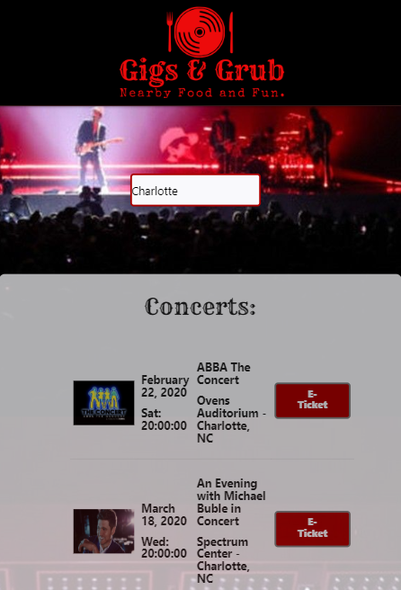

* Pixel 2

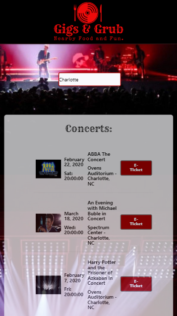

* Pixel 2 XL

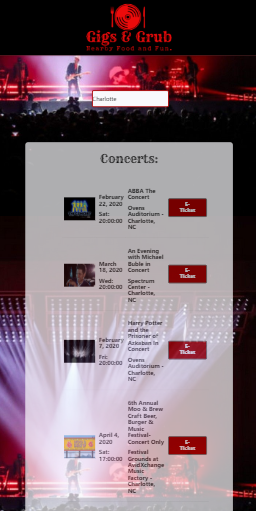

* iPhone 5 SE

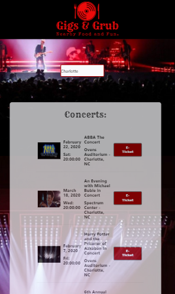

* iPhone 6/7/8

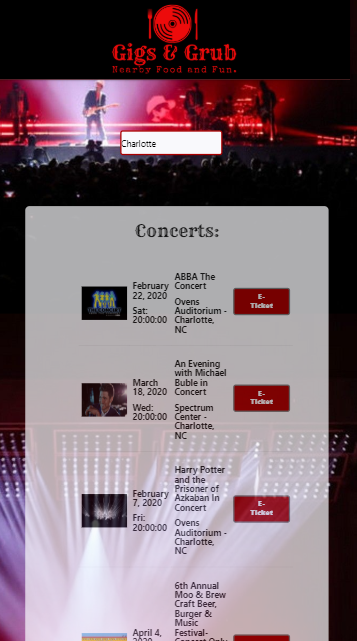

* iPhone 6/7/8 Plus 

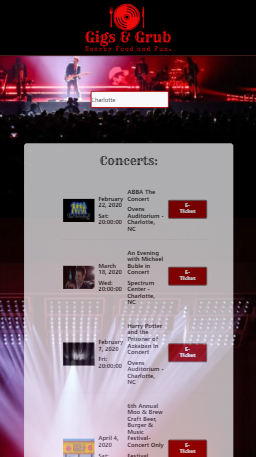

* iPhone X 

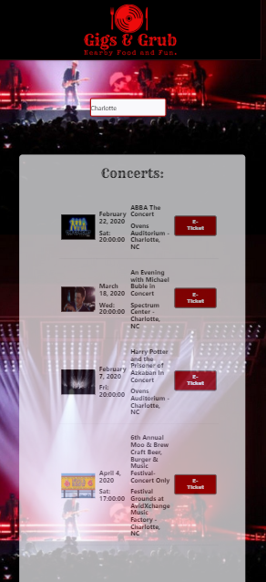

* iPad

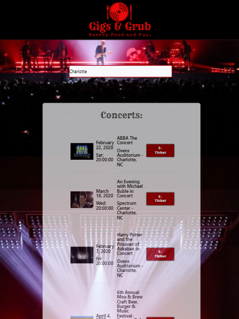

* iPad Pro

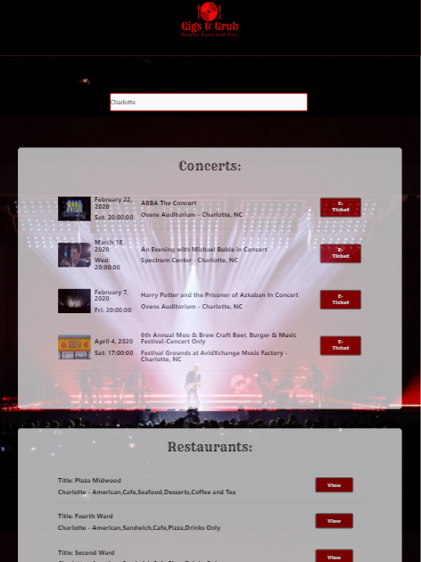

* Desktop

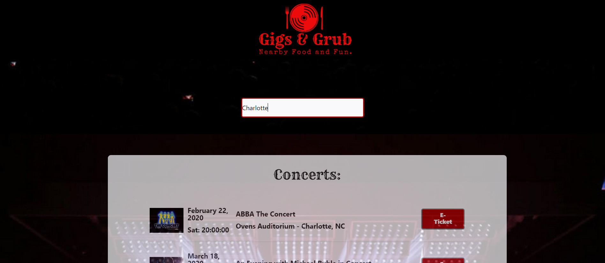

* Error Message for Incorrect Entry

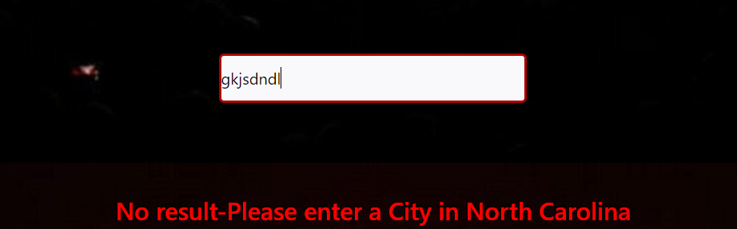

## Credits

Tasks and roles were broken down and assigned to group members based on coding strengths. For the application, Front-End Development was lead by [Meredith Grimes](https://github.com/magrimes); Back-End Development was lead by [Sile Kiman](https://github.com/Sile-Kiman). Group powerpoint and preliminary project research completed by [Reece Beirne](https://github.com/ReeceB96). All group members researched API's, background image, and CSS Framework to utilize for the project.

## License 

MIT License

Copyright (c) [2019] [Meredith Grimes; Sile Kiman; Reece Beirne]

Permission is hereby granted, free of charge, to any person obtaining a copy
of this software and associated documentation files (the "Software"), to deal
in the Software without restriction, including without limitation the rights
to use, copy, modify, merge, publish, distribute, sublicense, and/or sell
copies of the Software, and to permit persons to whom the Software is
furnished to do so, subject to the following conditions:

The above copyright notice and this permission notice shall be included in all
copies or substantial portions of the Software.

THE SOFTWARE IS PROVIDED "AS IS", WITHOUT WARRANTY OF ANY KIND, EXPRESS OR
IMPLIED, INCLUDING BUT NOT LIMITED TO THE WARRANTIES OF MERCHANTABILITY,
FITNESS FOR A PARTICULAR PURPOSE AND NONINFRINGEMENT. IN NO EVENT SHALL THE
AUTHORS OR COPYRIGHT HOLDERS BE LIABLE FOR ANY CLAIM, DAMAGES OR OTHER
LIABILITY, WHETHER IN AN ACTION OF CONTRACT, TORT OR OTHERWISE, ARISING FROM,
OUT OF OR IN CONNECTION WITH THE SOFTWARE OR THE USE OR OTHER DEALINGS IN THE
SOFTWARE.
